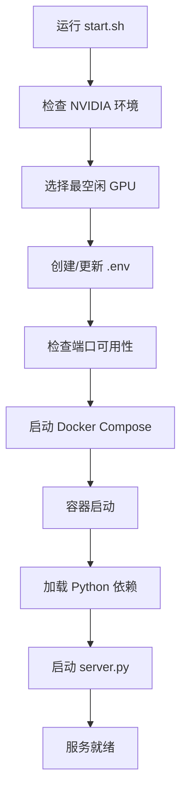

# VoxCPM Docker 项目结构

## 📁 文件结构

```
VoxCPM/
├── 🐳 Docker 相关
│   ├── Dockerfile              # Docker 镜像定义
│   ├── docker-compose.yml      # Docker Compose 配置
│   ├── .dockerignore          # Docker 构建忽略文件
│   ├── .env.example           # 环境变量模板
│   └── start.sh               # 一键启动脚本 ⭐
│
├── 🚀 服务端
│   ├── server.py              # 统一服务器 (UI + API) ⭐
│   ├── mcp_server.py          # MCP 服务器 ⭐
│   └── gpu_manager.py         # GPU 资源管理器 ⭐
│
├── 📖 文档
│   ├── QUICKSTART.md          # 快速启动指南 ⭐
│   ├── README_DOCKER.md       # Docker 部署文档 ⭐
│   ├── MCP_GUIDE.md           # MCP 使用指南 ⭐
│   ├── DOCKER_STRUCTURE.md    # 本文件
│   └── README.md              # 项目主文档
│
├── 🧪 测试
│   ├── test_deployment.sh     # 部署测试脚本
│   └── test_mcp.py            # MCP 测试脚本
│
├── ⚙️ 配置
│   ├── mcp_client.json        # MCP 客户端配置 ⭐
│   ├── Makefile               # 快捷命令
│   └── pyproject.toml         # Python 项目配置
│
├── 📂 数据目录
│   ├── models/                # 模型文件（挂载）
│   ├── outputs/               # 输出文件（挂载）
│   └── examples/              # 示例文件
│
└── 💻 源代码
    ├── src/voxcpm/            # VoxCPM 核心代码
    ├── app.py                 # 原始 Gradio 应用
    └── scripts/               # 训练脚本

⭐ = Docker 化新增文件
```

## 🔑 核心文件说明

### 1. server.py
**统一服务器，整合三种访问模式**

- **UI 模式**: Gradio 界面，路径 `/`
- **API 模式**: REST API，路径 `/api/*`
- **Swagger**: API 文档，路径 `/apidocs`

**特点**：
- 单端口服务（默认 7861）
- 共享 GPU 管理器
- 自动模型加载/卸载

### 2. mcp_server.py
**MCP 协议服务器**

提供 4 个工具：
- `text_to_speech`: 文本转语音
- `voice_cloning`: 声音克隆
- `get_gpu_status`: GPU 状态查询
- `offload_model`: 模型卸载

**特点**：
- 独立进程运行
- 与 API 共享 GPU 管理逻辑
- 支持程序化调用

### 3. gpu_manager.py
**GPU 资源管理器**

**功能**：
- 延迟加载模型
- 自动空闲卸载（默认 60 秒）
- 线程安全
- 强制卸载接口

**使用**：
```python
from gpu_manager import gpu_manager

# 获取模型（自动加载）
model = gpu_manager.get_model(load_func)

# 强制卸载
gpu_manager.force_offload()
```

### 4. start.sh
**一键启动脚本**

**功能**：
1. 检查 NVIDIA 环境
2. 自动选择最空闲 GPU
3. 检查端口可用性
4. 启动 Docker Compose
5. 显示访问信息

**使用**：
```bash
./start.sh
```

## 🔄 数据流

### UI 模式
```
用户浏览器 → Gradio UI → gpu_manager → VoxCPM 模型 → 音频输出
```

### API 模式
```
HTTP 请求 → Flask API → gpu_manager → VoxCPM 模型 → 音频响应
```

### MCP 模式
```
MCP 客户端 → MCP Server → gpu_manager → VoxCPM 模型 → 结果返回
```

## 🎯 设计原则

### 1. 单一 Docker 容器
- 所有服务运行在同一容器
- 共享 GPU 资源
- 统一管理

### 2. 三种访问方式
- **UI**: 适合人工交互
- **API**: 适合应用集成
- **MCP**: 适合 AI Agent

### 3. 智能 GPU 管理
- 按需加载
- 自动卸载
- 手动控制

### 4. 零配置启动
- 自动选择 GPU
- 自动检查端口
- 一键启动

## 📊 端口映射

| 容器端口 | 主机端口 | 服务 |
|---------|---------|------|
| 7861 | 7861 | UI + API + Swagger |

## 💾 卷挂载

| 容器路径 | 主机路径 | 用途 |
|---------|---------|------|
| /app/models | ./models | 模型缓存 |
| /app/outputs | ./outputs | 输出文件 |
| /root/.cache/huggingface | ~/.cache/huggingface | HF 缓存 |
| /root/.cache/modelscope | ~/.cache/modelscope | MS 缓存 |

## 🔐 环境变量

| 变量 | 默认值 | 说明 |
|------|--------|------|
| PORT | 7861 | 服务端口 |
| GPU_IDLE_TIMEOUT | 60 | GPU 空闲超时（秒）|
| NVIDIA_VISIBLE_DEVICES | 0 | GPU ID |
| HF_REPO_ID | openbmb/VoxCPM1.5 | 模型 ID |

## 🚦 启动流程



## 🧪 测试流程

```bash
# 1. 启动服务
./start.sh

# 2. 运行测试
./test_deployment.sh

# 3. 测试 MCP
./test_mcp.py
```

## 📈 性能考虑

### GPU 内存管理
- 模型大小: ~3GB
- 推理峰值: ~5GB
- 空闲自动释放

### 并发处理
- 单 GPU 串行处理
- 队列管理（Gradio 内置）
- 超时保护

### 缓存策略
- 模型文件缓存
- HuggingFace 缓存
- ModelScope 缓存

## 🔧 自定义扩展

### 添加新的 API 端点
编辑 `server.py`：
```python
@app.route('/api/custom', methods=['POST'])
def custom_endpoint():
    # 实现逻辑
    pass
```

### 添加新的 MCP 工具
编辑 `mcp_server.py`：
```python
@mcp.tool()
def new_tool(param: str) -> dict:
    """工具说明"""
    # 实现逻辑
    pass
```

### 修改 GPU 超时
修改 `.env`：
```bash
GPU_IDLE_TIMEOUT=120  # 2 分钟
```

## 🐛 调试技巧

### 查看实时日志
```bash
docker-compose logs -f
```

### 进入容器调试
```bash
docker exec -it voxcpm-service bash
```

### 检查 GPU 状态
```bash
# 主机
nvidia-smi

# 容器内
docker exec voxcpm-service nvidia-smi
```

### 测试 API
```bash
# 健康检查
curl http://localhost:7861/health

# GPU 状态
curl http://localhost:7861/api/gpu/status
```

## 📚 相关文档

- [快速启动](QUICKSTART.md) - 30 秒上手
- [部署指南](README_DOCKER.md) - 完整部署文档
- [MCP 指南](MCP_GUIDE.md) - MCP 使用说明
- [项目主页](README.md) - VoxCPM 介绍
