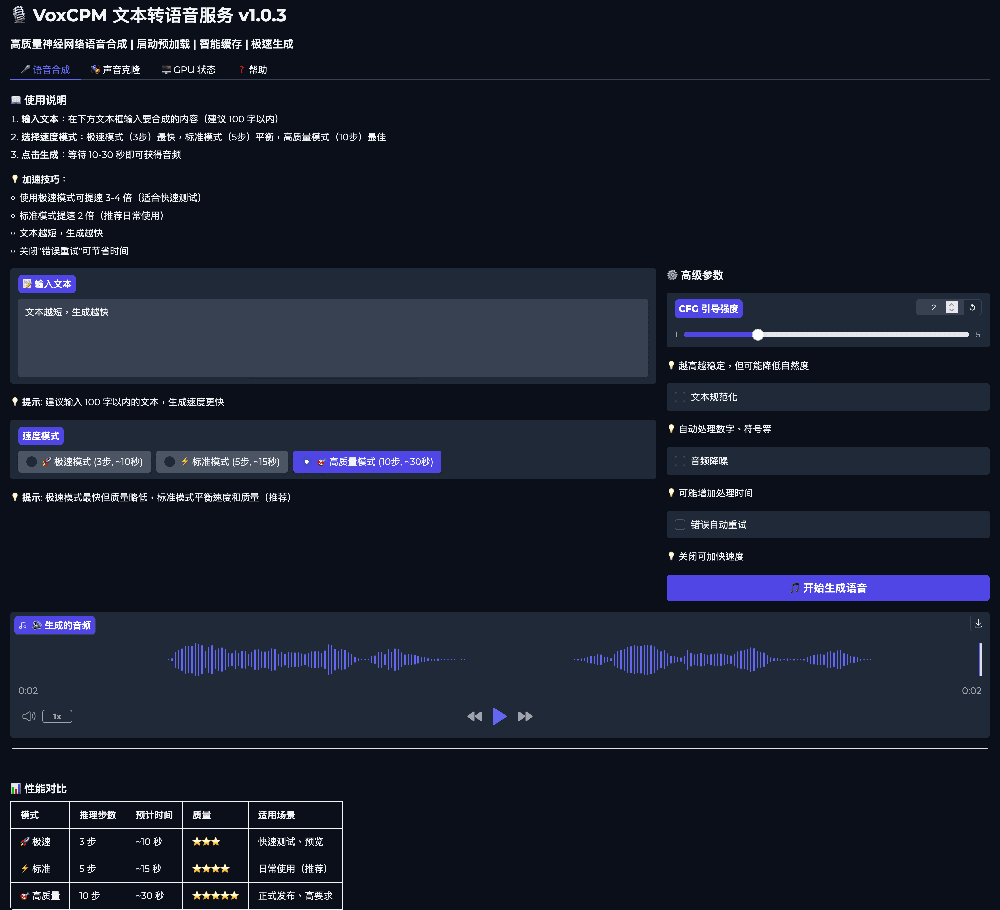

# 🎙️ VoxCPM Docker Deployment

[English](README_EN.md) | [简体中文](README_CN.md) | [繁體中文](README_TW.md) | [日本語](README_JP.md)

[](https://hub.docker.com/r/neosun/voxcpm-allinone)
[](LICENSE)
[](https://github.com/OpenBMB/VoxCPM)

> **Production-ready Docker deployment for VoxCPM TTS service with GPU support, REST API, Web UI, and MCP protocol integration.**

## 📸 UI Preview



## ✨ Features

- 🚀 **One-Click Deployment** - Single Docker image with all dependencies
- 🎨 **Gradio Web UI** - User-friendly interface for voice synthesis and cloning
- 🔌 **REST API** - Complete API with 12 VoxCPM parameters
- 🤖 **MCP Protocol** - Model Context Protocol integration for AI assistants
- 🎯 **GPU Auto-Management** - Automatic model loading/offloading with idle timeout
- 💾 **Persistent Storage** - Audio files saved to host directories
- 🔒 **HTTPS Support** - Nginx reverse proxy with SSL/TLS
- 📊 **Health Monitoring** - Built-in health checks and status endpoints
- 🌐 **Public Access** - Domain: https://voxcpm-tts.aws.xin

## 🎯 Quick Start

### Method 1: Docker Run (Recommended)

```bash
# Pull the image
docker pull neosun/voxcpm-allinone:1.0.8

# Run the container
docker run -d \
  --name voxcpm \
  --gpus all \
  -p 7861:7861 \
  -v /path/to/uploads:/app/uploads \
  -v /path/to/outputs:/app/outputs \
  --restart unless-stopped \
  neosun/voxcpm-allinone:1.0.8
```

### Method 2: Docker Compose

```yaml
version: '3.8'

services:
  voxcpm:
    image: neosun/voxcpm-allinone:1.0.8
    container_name: voxcpm-service
    runtime: nvidia
    environment:
      - NVIDIA_VISIBLE_DEVICES=all
      - PORT=7861
      - GPU_IDLE_TIMEOUT=60
    ports:
      - "7861:7861"
    volumes:
      - ./uploads:/app/uploads
      - ./outputs:/app/outputs
    restart: unless-stopped
    healthcheck:
      test: ["CMD", "curl", "-f", "http://localhost:7861/health"]
      interval: 30s
      timeout: 10s
      retries: 3
      start_period: 120s
```

Start the service:
```bash
docker-compose up -d
```

## 🌐 Access Points

| Service | URL | Description |
|---------|-----|-------------|
| Web UI | http://localhost:7861 | Gradio interface |
| API Docs | http://localhost:7861/docs | Swagger UI |
| Health Check | http://localhost:7861/health | Service status |
| GPU Status | http://localhost:7861/api/gpu/status | GPU info |
| Public URL | https://voxcpm-tts.aws.xin | HTTPS access |

## 📦 Installation

### Prerequisites

- Docker 20.10+
- Docker Compose 1.29+ (optional)
- NVIDIA GPU with CUDA 12.1 support
- NVIDIA Docker Runtime

### Install NVIDIA Docker Runtime

```bash
# Ubuntu/Debian
distribution=$(. /etc/os-release;echo $ID$VERSION_ID)
curl -s -L https://nvidia.github.io/nvidia-docker/gpgkey | sudo apt-key add -
curl -s -L https://nvidia.github.io/nvidia-docker/$distribution/nvidia-docker.list | \
  sudo tee /etc/apt/sources.list.d/nvidia-docker.list

sudo apt-get update
sudo apt-get install -y nvidia-docker2
sudo systemctl restart docker
```

### Verify GPU Access

```bash
docker run --rm --gpus all nvidia/cuda:12.1.0-base-ubuntu22.04 nvidia-smi
```

## ⚙️ Configuration

### Environment Variables

| Variable | Default | Description |
|----------|---------|-------------|
| `PORT` | 7861 | Service port |
| `GPU_IDLE_TIMEOUT` | 60 | GPU auto-offload timeout (seconds) |
| `NVIDIA_VISIBLE_DEVICES` | all | GPU device selection |
| `HF_REPO_ID` | openbmb/VoxCPM1.5 | Model repository |

### Volume Mounts

| Host Path | Container Path | Purpose |
|-----------|----------------|---------|
| `./uploads` | `/app/uploads` | Reference audio files |
| `./outputs` | `/app/outputs` | Generated audio files |

## 🎨 Usage Examples

### Web UI

1. Open http://localhost:7861 in your browser
2. Navigate to "Voice Synthesis" or "Voice Cloning" tab
3. Enter text and adjust parameters
4. Click "Generate" to create audio

### REST API

#### Text-to-Speech

```bash
curl -X POST http://localhost:7861/api/tts \
  -F "text=Hello, this is VoxCPM speaking." \
  -F "cfg_value=2.0" \
  -F "inference_timesteps=10" \
  -o output.wav
```

#### Voice Cloning

```bash
curl -X POST http://localhost:7861/api/tts \
  -F "text=Hello, this is a cloned voice." \
  -F "prompt_audio=@reference.wav" \
  -F "prompt_text=Reference transcript" \
  -F "cfg_value=2.0" \
  -o cloned.wav
```

#### GPU Status

```bash
curl http://localhost:7861/api/gpu/status
```

#### GPU Offload

```bash
curl -X POST http://localhost:7861/api/gpu/offload
```

### MCP Integration

See [MCP_GUIDE.md](MCP_GUIDE.md) for detailed integration instructions.

## 📊 API Parameters

| Parameter | Type | Default | Description |
|-----------|------|---------|-------------|
| `text` | string | required | Input text |
| `prompt_audio` | file | null | Reference audio for cloning |
| `prompt_text` | string | null | Reference transcript |
| `cfg_value` | float | 2.0 | Guidance strength (1.0-5.0) |
| `inference_timesteps` | int | 10 | Inference steps (5-50) |
| `min_len` | int | 2 | Minimum length |
| `max_len` | int | 4096 | Maximum length |
| `normalize` | bool | false | Text normalization |
| `denoise` | bool | false | Audio denoising |
| `retry_badcase` | bool | true | Retry on bad cases |
| `retry_badcase_max_times` | int | 3 | Max retry attempts |
| `retry_badcase_ratio_threshold` | float | 6.0 | Retry threshold |

See [PARAMETERS.md](PARAMETERS.md) for detailed parameter descriptions.

## 🏗️ Project Structure

```
VoxCPM/
├── Dockerfile.allinone      # All-in-one Docker image
├── docker-compose.yml        # Docker Compose configuration
├── server.py                 # FastAPI + Gradio server
├── gpu_manager.py            # GPU memory management
├── mcp_server.py             # MCP protocol server
├── .env.example              # Environment template
├── docs/                     # Documentation
├── examples/                 # Usage examples
└── src/                      # VoxCPM source code
```

## 🛠️ Tech Stack

- **Base Image**: nvidia/cuda:12.1.0-cudnn8-devel-ubuntu22.04
- **Python**: 3.10
- **PyTorch**: 2.5.1+cu121
- **VoxCPM**: 1.5
- **FastAPI**: Latest
- **Gradio**: Latest
- **Nginx**: Reverse proxy with SSL/TLS

## 📈 Performance

| Metric | Value |
|--------|-------|
| Image Size | 17.2GB |
| Container Startup | ~15 seconds |
| First Generation | ~110 seconds (with model loading) |
| Subsequent Generation | ~24 seconds |
| GPU Memory | 2.14GB (model loaded) |
| Audio Quality | 44.1kHz, 16-bit PCM |

## 🔧 Troubleshooting

### Container won't start

```bash
# Check logs
docker logs voxcpm

# Verify GPU access
docker run --rm --gpus all nvidia/cuda:12.1.0-base-ubuntu22.04 nvidia-smi
```

### Model loading fails

```bash
# Check disk space
df -h

# Manually download model
docker exec -it voxcpm python3 -c "from huggingface_hub import snapshot_download; snapshot_download('openbmb/VoxCPM1.5')"
```

### Port already in use

```bash
# Change port mapping
docker run -d --name voxcpm --gpus all -p 8080:7861 neosun/voxcpm-allinone:1.0.8
```

## 🤝 Contributing

Contributions are welcome! Please feel free to submit a Pull Request.

1. Fork the repository
2. Create your feature branch (`git checkout -b feature/AmazingFeature`)
3. Commit your changes (`git commit -m 'Add some AmazingFeature'`)
4. Push to the branch (`git push origin feature/AmazingFeature`)
5. Open a Pull Request

## 📝 Changelog

### v1.0.0 (2025-12-12)
- ✅ Initial release
- ✅ All-in-one Docker image
- ✅ FastAPI REST API with 12 parameters
- ✅ Gradio Web UI
- ✅ MCP protocol integration
- ✅ GPU auto-management
- ✅ HTTPS support with Nginx
- ✅ 14/14 tests passed

## 📄 License

This project is licensed under the Apache License 2.0 - see the [LICENSE](LICENSE) file for details.

## 🙏 Acknowledgments

- [VoxCPM](https://github.com/OpenBMB/VoxCPM) - Original TTS model
- [OpenBMB](https://github.com/OpenBMB) - Model development
- [ModelBest](https://modelbest.cn/) - Project sponsor

## ⭐ Star History

[](https://star-history.com/#OpenBMB/VoxCPM)

## 📱 Follow Us


---

**Made with ❤️ by the VoxCPM Community**
